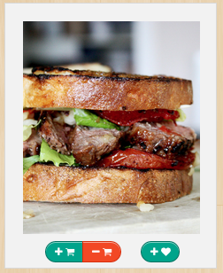
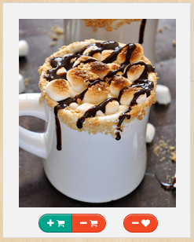

!SLIDE
hello.

!SLIDE 

# Displaying recipes

!SLIDE
## The problem

!SLIDE
* The `_recipe` partial is used in several views:
  - index
  - basket
  - favorites

* Different buttons depending on recipe status 

!SLIDE
### Basketed Recipe:

(Look at the buttons, not at the food porn)

!SLIDE
### Favorite Recipe:


!SLIDE
### Basketed and Favorite Recipe:


!SLIDE
## The solution

!SLIDE
### `RecipeRenderer`, the first attempt
- split every button in its own partial
- load right partials according to the recipe status

!SLIDE code
### `Renderer#button_partials`
```ruby
def button_partials
  button_partials = []
  if @user.in_basket?(@recipe)
    button_partials.push 'recipes/manage_in_basket_button'
  else
    button_partials.push 'recipes/add_to_basket_button'
  end

  if @user.in_favorites?(@recipe)
    button_partials.push 'recipes/remove_from_favorites_button'
  else
    button_partials.push 'recipes/add_to_favorites_button'
  end

  return button_partials
end
```

!SLIDE
### But
what about updating buttons on `ajax:success`?!
damn.

!SLIDE
### CSS to the rescue
- render all the buttons every time (retire `RecipeRenderer`)
- show/hide buttons depending on the class of the recipe
- `ajax:success` can just change the class of the recipe

!SLIDE code

#### Recipe view

```htmlembedded
<div class='recipe favorite'>
  <!-- delicious stuff -->
</div>
```

```sass
.controls
  .add-to-favorites-controls
    display: inline
  .remove-from-favorites-controls
    display: none
.favorite-recipe .controls
  .add-to-favorites-controls
    display: none
  .remove-from-favorites-controls
    display: inline
```

!SLIDE

# Demo
