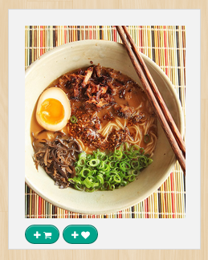

!SLIDE
hello.

!SLIDE

# Grocer Ease
Dan Hossom | Jeremy Sell | Leslie Lai | Martino Visintin

!SLIDE
## The problem
Cooking is fun. Figuring out and getting the ingredients you need is not.

!SLIDE
## The solution: Grocer Ease
- Choose recipes you want to cook. 
- Get the ingredients you need delivered to your door.

!SLIDE
## Except that...
* Instacart does not have an API (and building the scraping would take
  more than a week)
* TaskRabbit's API is not accepting new registrations `ಠ_ಠ`

!SLIDE
## Adjusting Strategy
* Let's focus on what we can build _now_
  - Finding recipes
  - Automating grocery list generation

!SLIDE
# Demo.


!SLIDE
## The feature
Signing in users through Facebook

## The solution
OmniAuth with Devise

!SLIDE
## The bits:
- What was needed from Facebook:

```ruby
  config.omniauth :facebook, ENV['FACEBOOK_ID'], ENV['FACEBOOK_SECRET'],
                   :scope => 'email,publish_actions'
```

- Sign-up or Sign-in:

```ruby
class OmniauthCallbacksController < Devise::OmniauthCallbacksController
  def facebook
    user = User.from_omniauth(request.env["omniauth.auth"])
    if user.persisted?
      flash.notice = "Signed in!"
      sign_in_and_redirect user
    else
      session["devise.user_attributes"] = user.attributes
      redirect_to new_user_registration_url
    end
  end
end
```

!SLIDE
## User creation from Omniauth:

```ruby
  def self.from_omniauth(auth)
    user = where(auth.slice(:provider, :uid)).first_or_initialize.tap do |user|
      user.provider = auth["provider"]
      user.uid = auth["uid"]
      user.name = auth["info"]["name"]
      user.password = Devise.friendly_token.first(16)
      user.email = auth["info"]["email"]
    end
    user.save
    user
  end
```

```ruby
  create_table "users", force: true do |t|
    t.string   "email",                  default: ""
    t.string   "encrypted_password",     default: ""
    t.string   "reset_password_token"
    t.datetime "reset_password_sent_at"
    t.datetime "remember_created_at"
    t.integer  "sign_in_count",          default: 0
    t.datetime "current_sign_in_at"
    t.datetime "last_sign_in_at"
    t.string   "current_sign_in_ip"
    t.string   "last_sign_in_ip"
    t.datetime "created_at"
    t.datetime "updated_at"
    t.string   "provider"
    t.string   "uid"
    t.string   "name"
  end
```


!SLIDE
## Recipe Search: Version 1

```ruby
class RecipesController < ApplicationController
  def search
    @recipes = Recipe.where("lower(title) like ?",
      "%#{params[:search].downcase}%)
  end
end
```

- Only works for 1 word searches
- Not very DRY

!SLIDE
## Refactoring Search
Re-use index route instead of creating a new route and view

```ruby
class RecipesController < ApplicationController
  def index
    @recipes = Recipe.search(params[:search])
  end
end
```

!SLIDE
## Refactoring Search
Move logic to the `Recipe` model

```ruby
class Recipe < ActiveRecord::Base
  def self.search(search)
    if search
      num_terms = search.split.length
      query = (['title ILIKE ?'] * num_terms).join(' AND ')
      Recipe.where(
        [query] +
        search.split.map { |term| "%#{term}%" })
    else
      Recipe.all
    end
  end
end
```

- Use `ILIKE` instead of `lower` and `downcase`
- Accommodate multiple search terms
- Return all recipes if no search term

!SLIDE

## The problem
Displaying recipes. We need to show different buttons depending on the status of the recipe.

!SLIDE
## The solution

* `RecipeRenderer`, the first attempt
  - split every button in its own partial
  - load needed partials according to the recipe status

!SLIDE code
### `Renderer#button_partials`
```ruby
def button_partials

  button_partials = []

  if @user.in_basket?(@recipe)
    button_partials.push 'recipes/manage_in_basket_button'
  else
    button_partials.push 'recipes/add_to_basket_button'
  end

  if @user.in_favorites?(@recipe)
    button_partials.push 'recipes/remove_from_favorites_button'
  else
    button_partials.push 'recipes/add_to_favorites_button'
  end

  return button_partials

end
```

!SLIDE
### Except that...
what about updating buttons on `ajax:success`?!

!SLIDE
### CSS to the rescue
- render all the buttons every time (retire `RecipeRenderer`)
- show/hide buttons depending on the `HTML` class of the recipe
- `ajax:success` can just change the class of the recipe

!SLIDE code

#### Default Recipe view
```htmlembedded
<div class='recipe'>
  <!-- delicious stuff -->
</div>
```

```sass
.controls
  .add-to-favorites-controls
    display: inline
  .remove-from-favorites-controls
    display: none
```
!SLIDE code
#### Favorite Recipe view
```htmlembedded
<div class='recipe favorite-recipe'>
  <!-- delicious stuff -->
</div>
```

```sass
.favorite-recipe .controls
  .add-to-favorites-controls
    display: none
  .remove-from-favorites-controls
    display: inline
```
!SLIDE

## The problem
Give the user feedback when she adds a recipe to her favorites or her
basket.

!SLIDE
## The solution
Badge icon that catches the users attention through
bouncing quickly.

!SLIDE
```javascript
function bindAddTo(destination, badge) {
    $('.add-to-' + destination).on('click', function(e) {
      e.preventDefault();
      var recipeContainer = $(this).closest('.recipe-container');
      badge.add($(this).attr('href'), recipeContainer);
    });
  }

  function bindRemoveFrom(destination, badge) {
    $('.remove-from-' + destination).on('click', function(e) {
      e.preventDefault();
      var recipeContainer = $(this).closest('.recipe-container');
      badge.remove($(this).attr('href'), recipeContainer);
    });
  };
```

!SLIDE
## Except that...
- Even after refactoring it was getting out of hand.
- Make a `Badge` class

!SLIDE
### `Badge`
```javascript
function Badge(destination) {
  this.destination = destination;
  var self = this;

  this.refresh().done(function(itemCount) {
    self.render(itemCount);
  });
}

Badge.prototype.render = function(itemCount, options) {
  options = options || {}
  var $destinationLink = $('#' + this.destination + '-link');
  if (itemCount === 0) {
    $destinationLink.find('.badger-outter').remove();
  } else {
    var newCount = itemCount.toString();
    $destinationLink.badger(newCount);
    if (options.bounce) {
      $destinationLink
        .stop()
        .effect('bounce', {times: 1}, "fast");
    }
  }
}
```

!SLIDE
## `Questions?`
